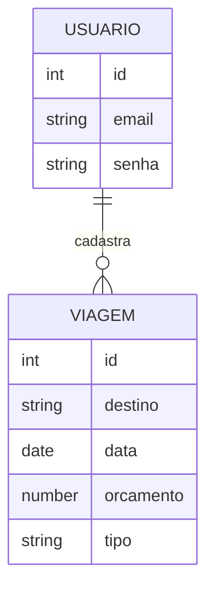

# Especificação Técnica

## Tecnologias Utilizadas

* HTML5
* CSS3
* Bootstrap
* JavaScript
* jQuery
* JSON Server (Fake API)
* Web Storage
* API pública de clima

---

# Modelo de Dados

O sistema possui duas principais entidades:

* Usuários
* Viagens

Usuários podem cadastrar múltiplas viagens.

---

# Diagrama de Dados (Mermaid)



---

# Estrutura da Fake API

Exemplo do arquivo `db.json`.

```json
{
  "usuarios": [
    {
      "id": 1,
      "email": "usuario@email.com",
      "senha": "123456"
    }
  ],
  "viagens": [
    {
      "id": 1,
      "destino": "Paris",
      "data": "2026-07-10",
      "orcamento": 3000,
      "tipo": "lazer"
    }
  ]
}
```

---

# Integrações externas

A aplicação também utiliza uma API pública de clima para mostrar informações meteorológicas do destino pesquisado.

Exemplo de dados consumidos:

* temperatura
* condição do clima
* ícone meteorológico

---

# Persistência de dados

Os dados são armazenados de duas formas:

**JSON Server**

* armazenamento das entidades do sistema
* usuários
* viagens

**Web Storage**

* usuário logado
* preferências de tema
* destinos favoritos

---

# Arquitetura da aplicação

A aplicação segue uma organização simples baseada em separação de responsabilidades.

```
/docs
prd.md
spec.md

/css
style.css

/js
login.js
cadastro.js
viagens.js
api.js

index.html
login.html
cadastro.html
viagens.html
```

---

# Requisições assíncronas

A aplicação utiliza **fetch API** para comunicação com o JSON Server.

Exemplo:

```javascript
fetch("http://localhost:3000/viagens")
.then(response => response.json())
.then(data => console.log(data))
```

---

# Responsividade

O layout utiliza **Bootstrap Grid System** para adaptação a diferentes tamanhos de tela:

* Mobile
* Tablet
* Desktop
